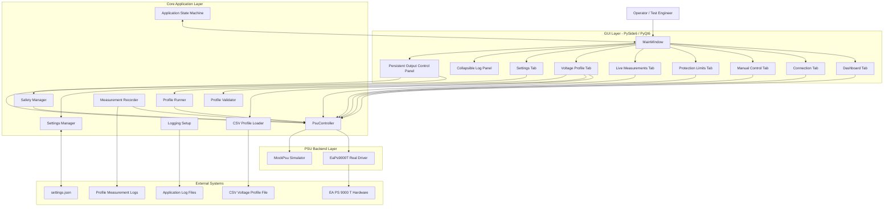
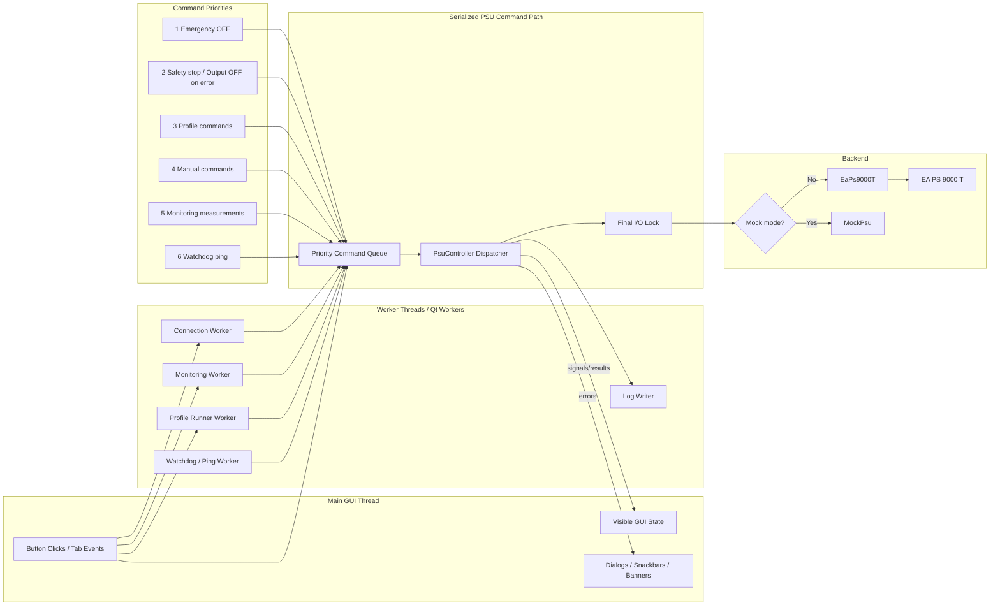
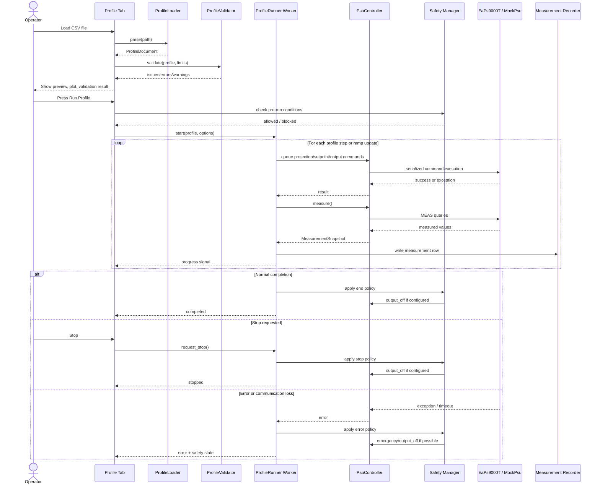
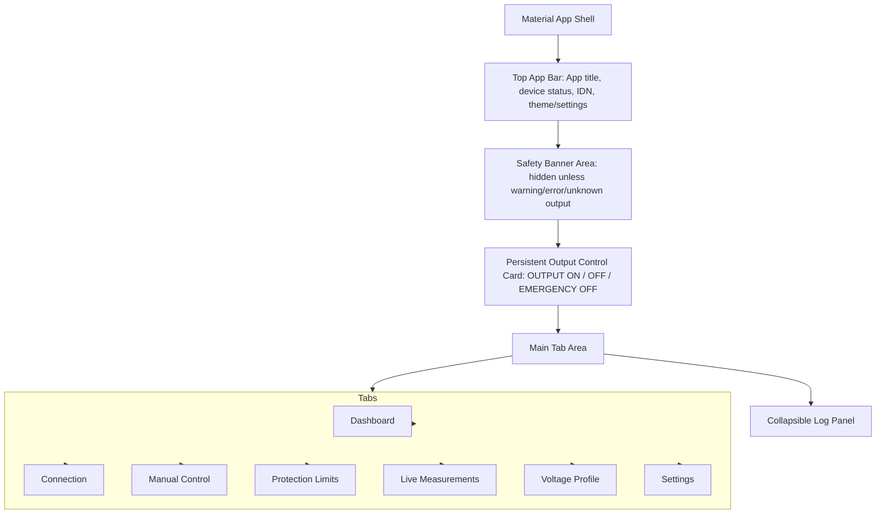
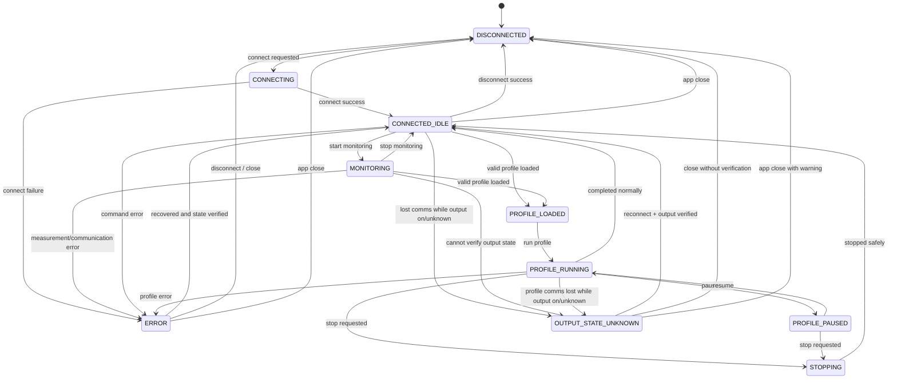

# AI Agent Task: Full-Feature GUI for EA PS 9000 T Power Supply

Document version: **1.3**  
Last updated: **2026-06-05**

---

# Change History

| Version | Date | Changes |
|---|---:|---|
| 1.0 | 2026-06-05 | Initial GUI task specification created from the EA PS 9000 T Python driver. |
| 1.1 | 2026-06-05 | Added missing implementation details: exact model/limit placeholders, import/rename rule, identity validation, single command queue, GUI state machine, safe output-on sequence, CSV dialect rules, ramp edge cases, timing expectations, communication-loss behavior, auto-reconnect policy, measurement/logging intervals, plot retention, settings location, Windows/Python target, manual hardware test, and expanded mock fault scenarios. |
| 1.2 | 2026-06-05 | Added modern Material Design UI requirements, dashboard tab, layout sketch, design tokens, component rules, icon and accessibility requirements, responsive-layout rules, settings JSON schema, explicit profile data models, pinned dependency guidance, package entry point, and phased implementation plan for AI-code generation. |
| 1.3 | 2026-06-05 | Added software architecture diagrams: layered application architecture, runtime thread/command-queue architecture, CSV profile execution flow, UI layout architecture, and application state machine diagram. |

---

## Source File

Use the existing Python driver file:

```text
EAPS9000T_class.py
```

If the provided file is named with a suffix or parentheses, for example:

```text
EAPS9000T_class(2).py
```

rename or copy it to:

```text
EAPS9000T_class.py
```

before importing it. Python imports should use:

```python
from EAPS9000T_class import EaPs9000T, PowerSupplyLimits, list_serial_ports
```

Do **not** change the driver's public API unless explicitly required.

The driver contains a production-oriented serial/SCPI class for EA Elektro-Automatik PS 9000 T power supplies.

The GUI must use the existing `EaPs9000T` class and its public API. Do **not** duplicate the low-level SCPI implementation in the GUI.

The driver already provides functionality for:

- Serial connection and disconnection.
- Device identity query.
- Remote control lock.
- Voltage, current, and power setpoints.
- OVP, OCP, and OPP protection limits.
- Output ON/OFF control.
- Measurement of voltage, current, and power.
- Health checks.
- SCPI error checks.
- Watchdog ping.
- Safe reconnect.
- Safe close with optional output-off behavior.

Main driver methods that should be used by the GUI:

```python
EaPs9000T(...)
ps.connect(...)
ps.close(...)
ps.ping()
ps.reconnect_safely()

ps.set_voltage(value)
ps.set_current(value)
ps.set_power(value)

ps.get_voltage_setpoint()
ps.get_current_setpoint()
ps.get_power_setpoint()

ps.set_ovp(value)
ps.set_ocp(value)
ps.set_opp(value)

ps.output_on(verify=True)
ps.output_off(verify=True)
ps.is_output_on()

ps.measure_all()
ps.measure_all_fast()

ps.check_errors()
ps.read_status_byte()
ps.check_device_health()
ps.enable_output_safely(...)
```

Also use:

```python
PowerSupplyLimits(...)
list_serial_ports()
```

---

# Missing User-Specific Configuration

Before implementation against real hardware, define these project-specific values. The GUI must support entering and saving these values, but the AI agent must not silently assume unsafe production defaults.

## Exact PSU Model and Limits

The EA PS 9000 T family contains multiple models. The driver defaults are only fallback/prototype values and may be unsafe for the actual unit.

Fill in the real target values before production use:

```text
Target PSU model: TODO, for example EA PS 9080-40 T
Voltage max: TODO V
Current max: TODO A
Power max: TODO W
OVP max: TODO V
OCP max: TODO A
OPP max: TODO W
Resistance max, if used: TODO ohm
```

The GUI must warn if default limits are used. In production mode, explicit `PowerSupplyLimits` should be required unless the user intentionally overrides the warning.

Example only; do not assume this model unless confirmed:

```python
PowerSupplyLimits(
    voltage_max=80.0,
    current_max=40.0,
    power_max=1500.0,
    ovp_max=88.0,
    ocp_max=44.0,
    opp_max=1650.0,
)
```

## Identity Validation

The GUI must expose optional identity validation fields so the user can prevent connection to the wrong instrument.

Required configurable fields:

```text
Expected IDN contains: TODO, for example EA and PS 9000
Expected model: TODO / optional
Expected serial number: TODO / optional
Station ID: TODO / optional
```

Pass these values to the driver when provided:

```python
EaPs9000T(
    expected_idn_contains=[...],
    expected_model=...,
    expected_serial=...,
    station_id=...,
)
```

## Target Runtime

Default target environment:

```text
Operating system: Windows 10/11
Python version: 3.11 or 3.12 preferred
GUI framework: PySide6 preferred
Serial interface: COM port using pyserial
```

Avoid Python 3.13 for packaged GUI builds unless all Qt and pyserial dependencies are verified.

## User Decisions Required

The GUI must make these policies explicit in settings:

```text
Allow auto-reconnect: yes/no
Output off at profile end: yes/no
Output off on profile stop: yes/no
Output off on profile error: yes/no
Output off on app close: yes/no
Disable manual controls during profile run: yes/no, default yes
CSV profile timing accuracy expectation: best-effort desktop timing
```

---

# Goal

Generate a full-featured desktop GUI application for controlling an EA PS 9000 T programmable DC power supply.

The GUI shall allow:

1. Manual control of voltage, current, power, and protection limits.
2. Safe output enable and disable.
3. Live measurement display.
4. Serial connection management.
5. Error and status monitoring.
6. Logging to GUI and file.
7. Running voltage profiles from a CSV file.
8. Plotting voltage, current, and power over time.
9. Safe stop behavior if profile execution is interrupted.
10. Mock/simulation mode for testing without real hardware.

Preferred GUI framework:

```text
PySide6
```

Alternative allowed framework:

```text
PyQt6
```

Fallback framework:

```text
Tkinter
```

Even if Tkinter is used, keep the architecture clean and production-oriented.

---

# Required Project Structure

Generate the project using this structure:

```text
ea_ps9000t_gui/
    main.py
    requirements.txt
    README.md

    EAPS9000T_class.py

    gui/
        __init__.py
        main_window.py
        dashboard_tab.py
        connection_tab.py
        manual_control_tab.py
        protection_tab.py
        measurement_tab.py
        profile_tab.py
        log_tab.py
        log_panel.py
        widgets.py
        material_theme.py

    gui/icons/
        README.md
        connect.svg
        disconnect.svg
        refresh.svg
        power.svg
        emergency_stop.svg
        warning.svg
        error.svg
        csv_file.svg
        play.svg
        pause.svg
        stop.svg
        save.svg
        settings.svg
        log.svg

    core/
        __init__.py
        psu_controller.py
        mock_psu.py
        profile_loader.py
        profile_runner.py
        profile_model.py
        app_state.py
        settings_model.py
        safety.py
        logging_setup.py
        exceptions.py

    examples/
        example_voltage_profile.csv

    logs/
        .gitkeep

    tests/
        __init__.py
        test_profile_loader.py
        test_profile_validation.py
        test_profile_runner.py
        test_limits_validation.py
        test_mock_psu.py
        test_measurement_log.py
        test_settings_schema.py
        test_app_state.py
```

---

# Architecture Requirements


# Software Architecture Diagrams

The AI agent must implement the GUI according to the architecture below. These diagrams are normative: generated code should follow this separation of responsibilities unless a documented technical reason requires a deviation.

## High-Level Layered Architecture



Architecture rules:

- GUI widgets must not call `EaPs9000T` directly.
- GUI widgets call `PsuController`, profile services, settings services, or application-state services.
- `PsuController` is the only owner of the real or mock PSU backend.
- `Safety Manager` owns safety policy decisions such as output-off-on-error, output-state-unknown handling, and emergency-off behavior.
- `ProfileRunner` owns timing and sequencing for CSV execution but must still send all PSU commands through `PsuController`.
- `Settings Manager` owns loading, validation, and saving of `settings.json`.
- `Logging Setup` owns application log configuration and must also feed the GUI log panel.

## Runtime Thread and Command-Queue Architecture



Runtime rules:

- The GUI thread must never perform serial I/O.
- All PSU commands must pass through one serialized command path.
- Emergency OFF must have the highest priority and must not be blocked behind monitoring traffic.
- Monitoring and watchdog traffic must be skipped or delayed if profile or safety commands are active.
- Worker threads must communicate back to the GUI using Qt signals/slots or a thread-safe queue.
- The final I/O lock remains required even if a command queue is used, because it protects against accidental direct backend access.

## CSV Voltage Profile Execution Flow



Profile-execution rules:

- The profile runner owns timing but not hardware access.
- Protection limits are applied before setpoints.
- Output commands are applied according to the configured output-command timing, default `after_setpoints`.
- Actual elapsed time must be logged for every applied step and ramp update.
- If communication is lost while output is believed ON, output state becomes `OUTPUT_STATE_UNKNOWN` until verified after reconnect.

## UI Layout Architecture



Required visual structure:

```text
┌────────────────────────────────────────────────────────────┐
│ Top App Bar: EA PS 9000 T GUI | Device | IDN | Status      │
├────────────────────────────────────────────────────────────┤
│ Safety Banner / Alarm Area                                │
├────────────────────────────────────────────────────────────┤
│ Persistent Output Control Card                            │
│ [OUTPUT ON] [OUTPUT OFF] [EMERGENCY OFF] State: OFF        │
├────────────────────────────────────────────────────────────┤
│ Tabs: Dashboard | Connection | Manual | Protection | ...   │
│                                                            │
│ Selected tab content                                      │
│                                                            │
├────────────────────────────────────────────────────────────┤
│ Collapsible Log Panel                                     │
└────────────────────────────────────────────────────────────┘
```

UI-architecture rules:

- The output-control card must remain visible on every tab.
- The safety banner must appear above normal controls and must not be hidden inside a tab.
- The log panel must be collapsible to preserve vertical space on 1366 × 768 screens.
- Main tabs must use cards, clear grouping, consistent spacing, and modern Material-style controls.
- The Dashboard tab is the default landing page after application startup.

## Application State Machine Diagram



State-machine rules:

- Every button-enable rule must be derived from this state machine.
- Normal manual setpoint controls are disabled in `PROFILE_RUNNING`, `PROFILE_PAUSED`, and `STOPPING`.
- Emergency OFF is enabled in all states except before the application has a controller instance.
- `OUTPUT_STATE_UNKNOWN` is safety-critical and must show a red banner until resolved.
- `ERROR` must never automatically return to `CONNECTED_IDLE`; the user or recovery logic must verify state first.


## Controller Layer

Create a controller wrapper around the power-supply driver.

The GUI must call the controller, not the driver directly everywhere.

Create:

```python
class PsuController:
    def connect(self, config): ...
    def disconnect(self): ...
    def reconnect_safely(self): ...
    def is_connected(self) -> bool: ...
    def ping(self) -> bool: ...

    def set_voltage(self, voltage_v: float): ...
    def set_current(self, current_a: float): ...
    def set_power(self, power_w: float): ...

    def get_voltage_setpoint(self) -> float: ...
    def get_current_setpoint(self) -> float: ...
    def get_power_setpoint(self) -> float: ...

    def set_ovp(self, ovp_v: float): ...
    def set_ocp(self, ocp_a: float): ...
    def set_opp(self, opp_w: float): ...

    def output_on(self, verify: bool = True): ...
    def output_off(self, verify: bool = True): ...
    def emergency_off(self): ...
    def is_output_on(self) -> bool: ...

    def measure(self) -> dict: ...
    def check_health(self) -> dict: ...
    def check_errors(self): ...
```

The controller must support two backends:

1. Real hardware using `EaPs9000T`.
2. Mock hardware using `MockPsu`.

## Core Data Models

Define explicit data models instead of passing unstructured dictionaries around the application. Use `dataclasses`, `typing.Literal`, and clear field names.

Minimum required profile model:

```python
from dataclasses import dataclass
from typing import Literal

@dataclass(frozen=True)
class ProfileStep:
    index: int
    source_row: int
    time_s: float
    voltage_v: float
    current_a: float | None = None
    power_w: float | None = None
    ovp_v: float | None = None
    ocp_a: float | None = None
    opp_w: float | None = None
    output: Literal["on", "off", "keep"] = "keep"
    ramp: Literal["step", "linear"] = "step"
    comment: str = ""

@dataclass(frozen=True)
class ProfileValidationIssue:
    row: int | None
    column: str | None
    message: str
    severity: Literal["error", "warning"]

@dataclass(frozen=True)
class ProfileDocument:
    path: str
    steps: list[ProfileStep]
    warnings: list[ProfileValidationIssue]
```

Minimum required runtime-status models:

```python
@dataclass(frozen=True)
class MeasurementSnapshot:
    timestamp_iso: str
    elapsed_s: float | None
    voltage_v: float
    current_a: float
    power_w: float
    output_on: bool | None
    status: str = "ok"
    message: str = ""

@dataclass(frozen=True)
class PsuConnectionConfig:
    port: str | None
    keyword: str
    baudrate: int
    timeout: float
    write_timeout: float
    retry_cnt: int
    retry_delay: float
    mock_mode: bool
    production_mode: bool
```

Avoid loosely typed dictionaries for profile rows, settings, measurement snapshots, and GUI state transitions unless they are only used for JSON serialization.

## Single Command Queue / Hardware Access Serialization

All access to the real or mock PSU must go through `PsuController`. The GUI, monitor worker, profile runner, watchdog, and manual-control buttons must not call the PSU concurrently.

Implement one of these approaches:

1. A single command queue owned by `PsuController`.
2. A single re-entrant lock around every PSU operation.

Preferred production design: a command queue with priority support.

Priority order:

```text
1. Emergency OFF
2. Safety stop / output OFF on error
3. Profile-run commands
4. Manual commands
5. Monitoring measurements
6. Watchdog ping
```

`Emergency OFF` must remain available even while a profile is running. Normal manual setpoint controls must be disabled during profile execution unless the user explicitly enables an advanced override mode.

## Application State Machine

Implement and document an application state machine. At minimum support:

```text
DISCONNECTED
CONNECTING
CONNECTED_IDLE
MONITORING
PROFILE_LOADED
PROFILE_RUNNING
PROFILE_PAUSED
STOPPING
ERROR
OUTPUT_STATE_UNKNOWN
```

The GUI must enable and disable buttons according to state.

Minimum state rules:

```text
DISCONNECTED: only connection, settings, mock mode, and profile loading are available.
CONNECTING: connection inputs disabled; cancel/disconnect may be available.
CONNECTED_IDLE: manual control, protection, monitoring, and profile run are available.
MONITORING: manual control remains available, but all commands remain serialized.
PROFILE_RUNNING: manual setpoints disabled; pause, stop, and emergency off enabled.
PROFILE_PAUSED: resume, stop, and emergency off enabled.
STOPPING: all non-emergency controls disabled until stop completes.
ERROR: output state must be checked; recovery actions only.
OUTPUT_STATE_UNKNOWN: show red safety banner; do not claim output is off.
```

---

# Threading Requirements

The GUI must never freeze because of serial communication.

Use worker threads or Qt worker objects for:

- Connecting to the device.
- Disconnecting from the device.
- Live monitoring.
- CSV profile execution.
- Long-running health checks.

If PySide6/PyQt6 is used:

- Use `QThread`, `QObject`, and signals/slots.
- Do not update GUI widgets directly from worker threads.
- Emit signals and update the GUI from the main thread.

If Tkinter is used:

- Use `threading.Thread` and `queue.Queue`.
- Use `after()` to update GUI safely.

---

# Main Window Layout

The main window shall contain:

- Top app bar / status bar.
- Safety banner / alarm area.
- Persistent output-control card.
- Tab widget.
- Collapsible logging panel at the bottom.

The output-control panel must always be visible, regardless of selected tab.

Required tabs:

1. Dashboard
2. Connection
3. Manual Control
4. Protection Limits
5. Live Measurements
6. Voltage Profile
7. Logs
8. Settings

Required layout sketch:

```text
┌────────────────────────────────────────────────────────────┐
│ Top App Bar: Device, Status, IDN, Theme, Settings          │
├────────────────────────────────────────────────────────────┤
│ Safety Banner / Alarm Area                                │
├────────────────────────────────────────────────────────────┤
│ Persistent Output Control Card                            │
│ [OUTPUT ON] [OUTPUT OFF] [EMERGENCY OFF] State: OFF        │
├────────────────────────────────────────────────────────────┤
│ Tabs: Dashboard | Connection | Manual | Protection | ...   │
│                                                            │
│ Selected tab content                                      │
│                                                            │
├────────────────────────────────────────────────────────────┤
│ Collapsible Log Panel                                     │
└────────────────────────────────────────────────────────────┘
```

---

# Modern Material Design UI Requirements

The GUI must use a modern **Material Design 3 inspired** visual style while preserving industrial safety clarity. It must not look like a default unstyled Qt or Tkinter application.

Preferred implementation:

```text
PySide6 + custom QSS Material-inspired theme
```

Allowed alternatives:

```text
PySide6 + qt-material
PyQt6 + qt-material
PySide6/PyQt6 + another lightweight modern theme library
```

Avoid heavy or internet-dependent UI frameworks. The packaged EXE must work offline.

## Material Visual Style

Use:

- Dark Material-style background.
- Card-based layout for grouped controls.
- Rounded panels and buttons.
- Consistent spacing.
- Clear visual hierarchy.
- Modern icons.
- Status chips/badges.
- Large readable measurement cards.
- Collapsible log panel.
- Responsive layouts that work on laptop screens.

Material styling must never reduce the visibility of safety-critical states. Output ON, emergency stop, communication loss, and unknown output state must remain visually dominant.

## Design Tokens

Create centralized constants in `gui/material_theme.py` or equivalent. Do not hard-code random spacing and colors throughout the GUI.

Minimum design tokens:

```text
spacing_xs = 4 px
spacing_sm = 8 px
spacing_md = 16 px
spacing_lg = 24 px
spacing_xl = 32 px
card_radius = 12 px
button_radius = 8 px
default_button_height = 36-44 px
large_button_height = 56-72 px
status_chip_height = 24-32 px
default_icon_size = 20-24 px
large_icon_size = 32-48 px
font_body = 10-11 pt
font_title = 14-16 pt
font_section = 16-18 pt
font_measurement = 28-40 pt
```

Define semantic colors, not only raw colors:

```text
color_background
color_surface
color_surface_variant
color_primary
color_secondary
color_success
color_warning
color_error
color_output_on
color_output_off
color_output_unknown
color_text_primary
color_text_secondary
color_border
```

## Material Component Rules

Use these UI patterns:

```text
Cards for grouped controls
Filled buttons for primary actions
Outlined buttons for secondary actions
Danger buttons for emergency/output actions
Status chips for connected/output/profile states
Snackbars or status-bar messages for non-critical feedback
Modal dialogs for safety-critical confirmation
Progress bars for connection/profile execution
Material-styled data table for CSV preview
Tooltips for important controls
```

Required safety-specific button styling:

```text
OUTPUT ON: large filled warning/danger button
OUTPUT OFF: large filled safe/neutral button
EMERGENCY OFF: largest red danger button, always visible
Connected: green status chip with text and icon
Disconnected: red/gray status chip with text and icon
Output unknown: red status chip/banner with warning icon and text
Profile running: blue/yellow status chip with progress indicator
```

## Icon Requirements

Use a consistent icon set, for example Material Symbols or locally bundled Qt-compatible SVG icons.

Icons are required for:

- Connect.
- Disconnect.
- Refresh ports.
- Output ON/OFF.
- Emergency stop.
- Warning.
- Error.
- CSV load.
- Run.
- Pause.
- Resume.
- Stop.
- Save/export.
- Settings.
- Logs.

Icons must be bundled locally for packaged EXE builds. Do not depend on internet access at runtime.

## Accessibility and Safety UI Rules

Do not rely on color alone. Every colored status must also include text and/or an icon.

Required accessibility rules:

```text
Minimum supported contrast must be suitable for dark theme.
Emergency OFF must be visually distinct by color, text, size, and position.
Critical dialogs must be keyboard accessible.
Important buttons must have tooltips.
Status chips must include both text and icon.
Input validation errors must be shown near the relevant field and in the log.
```

## Responsive Layout Requirements

Minimum supported resolution:

```text
1366 x 768
```

Recommended resolution:

```text
1920 x 1080
```

Rules:

- Use scroll areas where needed.
- Use splitters for resizable tables, plots, and logs.
- The log panel must be collapsible.
- The CSV preview table must resize with the window.
- Large measurement cards must remain visible on 1366 x 768.
- No critical control may disappear below the visible screen area.

---

# Tab 1: Dashboard

Add a dashboard tab as the first operator-facing page. It must provide a single overview screen for common operation and safety state.

The dashboard shall show:

- Connection state.
- Device IDN/model/serial if known.
- Output state.
- Large measured voltage/current/power cards.
- Voltage/current/power setpoint cards.
- Active OVP/OCP/OPP protection values.
- Remote-lock owner.
- Profile state and progress if a profile is loaded or running.
- Last error or warning.
- Last measurement timestamp.
- Communication quality / last ping result.

The dashboard may include quick actions:

- Start monitoring.
- Stop monitoring.
- Open CSV profile tab.
- Open settings.

The dashboard must not duplicate every control from other tabs. It should focus on status, quick actions, and safe operator awareness.

---

# Persistent Output Control Panel

This panel must always be visible.

Include:

- Large `OUTPUT ON` button.
- Large `OUTPUT OFF` button.
- Large `EMERGENCY OFF` button.
- Output-state indicator.
- Checkbox: `Verify output switching`.
- Checkbox: `Output OFF on disconnect`.
- Checkbox: `Output OFF on application close`.

Required behavior:

```python
ps.output_on(verify=True)
ps.output_off(verify=True)
```

Emergency off must immediately call:

```python
ps.output_off(verify=True)
```

If verification fails, show a red safety warning banner.

Before enabling output, show a confirmation dialog containing:

- Voltage setpoint.
- Current setpoint.
- Power setpoint.
- OVP.
- OCP.
- OPP.

User must confirm before output turns on.

## Required Safe OUTPUT ON Sequence

When the user enables output from the GUI, use this sequence instead of simply sending `OUTP ON`:

1. Verify device is connected.
2. Verify or request remote control.
3. Check that configured model limits are explicit and not unsafe defaults.
4. Validate voltage, current, power, OVP, OCP, and OPP against `PowerSupplyLimits`.
5. Apply protection limits first: OVP, OCP, OPP.
6. Apply voltage/current/power setpoints.
7. Verify setpoints where possible.
8. Show confirmation dialog with all setpoints and limits.
9. Enable output with verification.
10. Read output state back and update GUI.

Use the driver's `enable_output_safely(...)` method where appropriate.

If OVP/OCP/OPP values are missing, unknown, or still at unsafe defaults, warn the user before enabling output.

---

# Tab 1: Connection

Include:

- Serial port dropdown.
- Refresh ports button.
- Manual port input.
- Device keyword input.
- Baudrate input.
- Timeout input.
- Write-timeout input.
- Retry count input.
- Retry delay input.
- Mock mode checkbox.
- Production mode checkbox.
- Connect button.
- Disconnect button.
- Reconnect safely button.
- IDN display.
- Connection status indicator.
- Remote-lock owner display.
- Ping status display.
- Last communication error display.

Default values:

```text
keyword = PS 9000 T
baudrate = 115200
timeout = 1.0
write_timeout = 1.0
retry_cnt = 3
retry_delay = 0.2
```

Use:

```python
list_serial_ports()
EaPs9000T(...)
ps.connect()
ps.close()
ps.ping()
ps.reconnect_safely()
```

Connection status colors:

```text
Green  = connected
Red    = disconnected
Yellow = warning or degraded state
Gray   = unknown
```

## Auto-Reconnect Policy

Auto-reconnect must be configurable and disabled by default for safety.

Settings:

```text
Auto reconnect: enabled/disabled, default disabled
Reconnect interval: default 5 s
Maximum reconnect attempts: default 3
After reconnect: output must remain OFF unless user manually enables it again
```

If communication is lost while the output is believed to be ON:

1. Mark output state as unknown.
2. Stop any running profile.
3. Show a red safety banner.
4. Do not assume output is OFF.
5. Attempt safe reconnect only if auto-reconnect is enabled.
6. After reconnect, verify state before allowing further operation.

---

# Tab 2: Manual Control

Include controls for:

## Voltage

- Voltage setpoint input, V.
- Set voltage button.
- Read voltage setpoint button.
- Display read-back voltage setpoint.

## Current

- Current setpoint input, A.
- Set current button.
- Read current setpoint button.
- Display read-back current setpoint.

## Power

- Power setpoint input, W.
- Set power button.
- Read power setpoint button.
- Display read-back power setpoint.

## Combined Actions

- Apply all setpoints button.
- Verify all setpoints button.

Use:

```python
ps.set_voltage(value)
ps.set_current(value)
ps.set_power(value)

ps.get_voltage_setpoint()
ps.get_current_setpoint()
ps.get_power_setpoint()

ps.verify_setpoints(...)
```

The GUI must validate all values before sending them to the instrument.

---

# Tab 3: Protection Limits

Include controls for:

- OVP, over-voltage protection, V.
- OCP, over-current protection, A.
- OPP, over-power protection, W.

Buttons:

- Set OVP.
- Set OCP.
- Set OPP.
- Apply all protection limits.

Use:

```python
ps.set_ovp(value)
ps.set_ocp(value)
ps.set_opp(value)
```

Also include a section for configuring model limits before connection:

```python
PowerSupplyLimits(
    voltage_min=0.0,
    voltage_max=...,
    current_min=0.0,
    current_max=...,
    power_min=0.0,
    power_max=...,
    ovp_min=0.0,
    ovp_max=...,
    ocp_min=0.0,
    ocp_max=...,
    opp_min=0.0,
    opp_max=...
)
```

Add a warning if default limits are used.

The user must be able to save and load limit presets as JSON.

Example preset:

```json
{
  "name": "EA PS 9080-40 T",
  "voltage_max": 80.0,
  "current_max": 40.0,
  "power_max": 1500.0,
  "ovp_max": 88.0,
  "ocp_max": 44.0,
  "opp_max": 1650.0
}
```

---

# Tab 4: Live Measurements

Display large live values:

- Measured voltage, V.
- Measured current, A.
- Measured power, W.

Also display:

- Voltage setpoint.
- Current setpoint.
- Power setpoint.
- Output state.
- Status byte.
- SCPI error queue.
- Remote owner.
- Output state unknown flag.

Controls:

- Start monitoring button.
- Stop monitoring button.
- Monitoring interval input, ms.
- Use fast measurement checkbox.
- Clear plot button.
- Export measurements to CSV button.

Default monitoring interval:

```text
500 ms
```

Use:

```python
ps.measure_all()
ps.measure_all_fast()
ps.read_status_byte()
ps.get_errors()
ps.check_device_health()
```

Plot live data:

- Voltage vs time.
- Current vs time.
- Power vs time.

Use matplotlib, pyqtgraph, or Qt Charts.

The plot must be optional and must not slow down communication.

## Live Data Retention

The live plot should not grow without limit.

Default retention:

```text
Display last 30 minutes of live data in memory.
Write full data to CSV only when export or logging is enabled.
```

The retention duration must be configurable.

---

# Tab 5: Voltage Profile from CSV

The GUI must allow the user to load, validate, preview, plot, and run a voltage profile from a `.csv` file.

The user may call it `CVS`, but implement the standard CSV format.

## Required CSV Format

Example:

```csv
time_s,voltage_v,current_a,power_w,output
0,0,1.0,100,off
1,5,1.0,100,on
5,12,1.5,200,on
10,24,2.0,300,on
15,0,1.0,100,off
```

## CSV Dialect Rules

The parser must support this dialect:

```text
Encoding: UTF-8, UTF-8 with BOM allowed
Separator: comma
Decimal separator: dot
Header row: required
Column names: case-insensitive
Whitespace around column names and values: ignored
Blank lines: ignored
Comment lines beginning with #: ignored
Unknown columns: allowed but ignored, with warning in validation panel
```

The parser must not use locale-dependent decimal parsing.

## Required Columns

```text
time_s
voltage_v
```

## Optional Columns

```text
current_a
power_w
ovp_v
ocp_a
opp_w
output
ramp
comment
```

## Column Meaning

### `time_s`

Absolute time from profile start in seconds.

Rules:

- Must be numeric.
- Must be zero or positive.
- Must be strictly increasing.

### `voltage_v`

Voltage setpoint in volts.

Rules:

- Must be numeric.
- Must be inside configured voltage limits.

### `current_a`

Optional current setpoint in amperes.

If missing or empty, keep the current setting already configured in the GUI.

### `power_w`

Optional power setpoint in watts.

If missing or empty, do not change the power setpoint.

### `ovp_v`

Optional over-voltage protection in volts.

If present, apply before voltage/current/power setpoints.

### `ocp_a`

Optional over-current protection in amperes.

If present, apply before voltage/current/power setpoints.

### `opp_w`

Optional over-power protection in watts.

If present, apply before voltage/current/power setpoints.

### `output`

Optional output command.

Allowed values:

```text
on
off
keep
```

If missing or empty, default to:

```text
keep
```

Output commands are applied after protection limits and setpoints by default.

The profile runner may optionally support this setting:

```text
Output command timing: before_setpoints / after_setpoints
Default: after_setpoints
```

### `ramp`

Optional ramp mode.

Allowed values:

```text
step
linear
```

If missing or empty, default to:

```text
step
```

For `step`, apply the value at the row time.

For `linear`, interpolate voltage between the current row and the next row.

If the final row has `ramp=linear`, treat it as `step` because there is no next row.

### `comment`

Optional text comment. It is ignored by the runner but shown in the preview table and logs.

---

# Voltage Profile Tab GUI Requirements

Include:

- Load CSV button.
- Reload CSV button.
- Save example CSV button.
- Table preview of CSV rows.
- Validation result panel.
- Profile plot.
- Run profile button.
- Pause button.
- Resume button.
- Stop button.
- Emergency off button.
- Progress bar.
- Current step display.
- Current target voltage display.
- Elapsed time display.
- Remaining time display.
- Ramp update interval input, default 100 ms.
- Profile measurement log interval input, default 500 ms.
- Live display update interval input, default 500 ms.
- Checkbox: output off at end.
- Checkbox: output off on stop.
- Checkbox: output off on error.
- Checkbox: log measurements during profile.
- Measurement log file path selector.

Profile plot must show:

- Voltage vs time.
- Current vs time, if column exists.
- Power vs time, if column exists.
- Output state markers, if output column exists.

---

# CSV Validation Requirements

Before running a profile, validate:

1. File exists.
2. File can be parsed as CSV.
3. Required columns exist:
   - `time_s`
   - `voltage_v`
4. All numeric values are valid.
5. `time_s` starts at zero or positive.
6. `time_s` is strictly increasing.
7. Voltage values are within configured `PowerSupplyLimits`.
8. Current values are within configured limits.
9. Power values are within configured limits.
10. OVP values are within configured limits.
11. OCP values are within configured limits.
12. OPP values are within configured limits.
13. Output values are only:
    - `on`
    - `off`
    - `keep`
14. Ramp values are only:
    - `step`
    - `linear`
15. Empty optional fields are handled correctly.

If validation fails:

- Do not allow the profile to run.
- Show row number.
- Show column name.
- Show exact error message.

Example validation error:

```text
Row 7, column voltage_v: 900.0 V is outside allowed range 0.0..500.0 V
```

---

# Timing Expectations

CSV profile execution uses best-effort desktop timing. It is not hard real-time control.

Requirements:

```text
Use time.monotonic() for elapsed profile timing.
Log actual elapsed time for every applied setpoint.
Do not hide timing overruns; log them as warnings.
Ramp update interval default: 100 ms.
Profile measurement log interval default: 500 ms.
Live GUI display interval default: 500 ms.
```

Measurement logging interval must be configurable and may be independent from ramp update interval.

---

# Profile Execution Logic

Profile execution must run in a background worker thread.

Use:

```python
time.monotonic()
```

Do not use `time.time()` for elapsed profile timing.

For each CSV row:

1. Wait until `time_s` relative to profile start.
2. Apply protection limits first if present:

```python
ps.set_ovp(...)
ps.set_ocp(...)
ps.set_opp(...)
```

3. Apply current setpoint if present:

```python
ps.set_current(...)
```

4. Apply power setpoint if present:

```python
ps.set_power(...)
```

5. Apply voltage setpoint:

```python
ps.set_voltage(...)
```

6. Apply output command if requested:

```python
ps.output_on(verify=True)
ps.output_off(verify=True)
```

7. Read measurements:

```python
ps.measure_all()
```

8. Emit progress update to the GUI.
9. Log setpoints and measurements.

---

# Linear Ramp Behavior

If a row has:

```text
ramp = linear
```

then voltage must be interpolated between this row and the next row.

Example:

```python
fraction = elapsed_between_rows / duration_between_rows
voltage = v_start + (v_end - v_start) * fraction
ps.set_voltage(voltage)
```

The ramp update interval must be configurable.

Default:

```text
100 ms
```

Do not send setpoint updates faster than the configured ramp interval.

For each ramp update:

- Set interpolated voltage.
- Optionally log measurement.
- Update GUI progress.

Current and power should normally step at row boundaries unless explicitly extended later.

If the final row has `ramp=linear`, execute it as a step setpoint.

---

# Pause / Resume Behavior

When the user presses `Pause`:

- Stop advancing profile time.
- Keep current voltage setpoint unless safety settings require output off.
- Continue allowing emergency off.
- Continue showing live measurements if monitoring is enabled.

When the user presses `Resume`:

- Continue profile timing from where it paused.
- Do not skip steps.

---

# Stop Behavior

When the user presses `Stop`:

1. Request the profile worker to stop safely.
2. Do not kill the thread unsafely.
3. If `Output off on stop` is enabled, call:

```python
ps.output_off(verify=True)
```

4. Save measurement log if enabled.
5. Mark profile as stopped.
6. Update GUI state.

---

# End-of-Profile Behavior

When the profile ends normally:

- Mark profile as completed.
- Save logs.
- If `Output off at end` is enabled, call:

```python
ps.output_off(verify=True)
```

---

# Error Behavior

If an exception happens during profile execution:

1. Stop profile execution.
2. Show error message in GUI.
3. Log full traceback.
4. If `Output off on error` is enabled, call:

```python
ps.output_off(verify=True)
```

5. If output-off verification fails, show a red safety warning:

```text
SAFETY WARNING: Output state could not be verified. Treat output as unknown.
```

---

# Logging Requirements

Create a GUI logging panel.

Log at least:

- Application start.
- Connection attempts.
- Connection success.
- Connection failure.
- Disconnection.
- Reconnection attempts.
- Output ON/OFF events.
- Emergency OFF events.
- Manual setpoint changes.
- Protection limit changes.
- Live measurement errors.
- CSV file loaded.
- CSV validation result.
- Profile start.
- Profile pause.
- Profile resume.
- Profile stop.
- Profile completion.
- Profile errors and tracebacks.
- Safety warnings.

Also write log files to:

```text
logs/ea_ps9000t_gui_YYYYMMDD_HHMMSS.log
```

---

# Profile Measurement Log

If enabled, save a CSV measurement log during profile execution.

Required columns:

```csv
timestamp_iso,elapsed_s,step_index,set_voltage_v,set_current_a,set_power_w,measured_voltage_v,measured_current_a,measured_power_w,output_state,status,message
```

Example row:

```csv
2026-06-05T14:22:30.123456,5.250,3,12.0,1.5,200.0,11.998,1.497,17.96,on,ok,
```

---

# Mock Mode

Add a mock/simulation mode so the GUI can be tested without real hardware.

The GUI must include:

```text
Use Mock PSU
```

When enabled:

- No serial port is required.
- The controller uses `MockPsu` instead of `EaPs9000T`.

The mock PSU must simulate:

- Connection.
- Disconnection.
- IDN response.
- Remote mode.
- Voltage setpoint.
- Current setpoint.
- Power setpoint.
- OVP/OCP/OPP.
- Output on/off.
- Measurements with small random noise.
- SCPI error queue.
- Optional communication error injection.
- Optional slow response simulation.

The mock PSU must enforce the same `PowerSupplyLimits` as the real controller and raise equivalent errors for out-of-range commands.

The mock PSU must also support configurable fault injection:

```text
Communication timeout
Wrong IDN
Range error
Output ON verification failure
Output OFF verification failure
SCPI error queue not empty
Slow measurement response
Serial disconnect during profile
Remote lock failure
Output state unknown
```

Mock IDN example:

```text
MOCK,EA-PS9000T,000000,FW:SIM
```

---

# Safety Requirements

The GUI controls a real power supply. Safety is mandatory.

Implement:

1. Range validation before every command.
2. Confirmation dialog before output ON.
3. Emergency OFF always visible.
4. Output OFF during close if configured.
5. Output OFF on profile stop if configured.
6. Output OFF on profile error if configured.
7. No profile run unless device is connected.
8. No output ON unless voltage/current/protection values are valid.
9. No silent exception swallowing.
10. Clear error messages for driver exceptions.
11. Red safety banner for unknown output state.
12. Red safety banner for failed output-off verification.
13. Communication-loss warning.
14. SCPI error warning.
15. Protection/range error warning.
16. Stop profile immediately on communication loss.
17. If communication is lost while output was ON or unknown, treat this as safety-critical.

Communication-loss behavior:

```text
If output was believed OFF: show warning and stop active operations.
If output was believed ON: show red safety banner and mark output state unknown.
If output state cannot be read: mark output state unknown.
Never claim the output is OFF after communication loss unless it was verified after reconnect.
```

Handle driver exception classes such as:

```python
EAPSError
CommunicationError
CommandTimeoutError
RemoteControlError
InstrumentCommandError
RangeError
DriverClosedError
ConfigurationError
DeviceIdentityError
SafetyStateError
InstrumentAlarmError
```

---

# Settings Tab

Include application settings:

- Theme selection.
- Default monitoring interval.
- Default ramp interval.
- Default log directory.
- Default CSV profile directory.
- Default limit preset.
- Output off on close default.
- Output off on error default.
- Confirm before output ON default.
- Fast measurement default.

Save settings to JSON:

```text
settings.json
```

Default settings location for portable mode:

```text
./settings.json
```

Optional Windows per-user location:

```text
%APPDATA%/EA_PS9000T_GUI/settings.json
```

The application must clearly show which settings file is active.

## Required Settings JSON Schema

Define and document a stable settings schema. The application must tolerate missing fields by applying safe defaults, but it must not silently use unsafe electrical limits in production mode.

Example `settings.json`:

```json
{
  "schema_version": 1,
  "theme": "dark_material",
  "mock_mode": true,
  "serial": {
    "port": "COM8",
    "baudrate": 115200,
    "timeout": 1.0,
    "write_timeout": 1.0,
    "retry_cnt": 3,
    "retry_delay": 0.2,
    "keyword": "PS 9000 T"
  },
  "identity": {
    "expected_idn_contains": ["EA", "PS 9000"],
    "expected_model": "",
    "expected_serial": "",
    "station_id": "EA_PS9000T_GUI"
  },
  "limits": {
    "preset_name": "EA PS 9080-40 T",
    "voltage_min": 0.0,
    "voltage_max": 80.0,
    "current_min": 0.0,
    "current_max": 40.0,
    "power_min": 0.0,
    "power_max": 1500.0,
    "ovp_min": 0.0,
    "ovp_max": 88.0,
    "ocp_min": 0.0,
    "ocp_max": 44.0,
    "opp_min": 0.0,
    "opp_max": 1650.0
  },
  "safety": {
    "confirm_output_on": true,
    "verify_output_switching": true,
    "output_off_on_disconnect": true,
    "output_off_on_close": true,
    "output_off_at_profile_end": true,
    "output_off_on_profile_stop": true,
    "output_off_on_profile_error": true,
    "disable_manual_controls_during_profile": true
  },
  "profile": {
    "default_profile_dir": "examples",
    "ramp_update_interval_ms": 100,
    "measurement_log_interval_ms": 500,
    "live_display_interval_ms": 500,
    "output_command_timing": "after_setpoints"
  },
  "logging": {
    "log_dir": "logs",
    "retain_days": 30
  },
  "ui": {
    "live_plot_retention_minutes": 30,
    "collapse_log_panel_on_start": false
  }
}
```

The application must validate the settings file at startup. Invalid settings must be reported clearly, and the application should fall back to mock mode or safe disconnected state rather than connecting with unsafe values.

---

# UI Style Requirements

This section supplements the Modern Material Design requirements above. Use a dark industrial Material-inspired theme.

Important visual states:

```text
Connected        = green
Disconnected     = red
Warning          = yellow/orange
Error            = red
Output ON        = bright red/orange
Output OFF       = gray or green
Profile running  = blue/yellow
Profile stopped  = gray
Profile complete = green
```

Live voltage/current/power values must use large readable fonts.

The GUI should be usable on a laptop screen without controls disappearing below the visible area.

Use scroll areas where needed.

---

# Example CSV File

Generate this file:

```text
examples/example_voltage_profile.csv
```

Content:

```csv
time_s,voltage_v,current_a,power_w,ovp_v,ocp_a,opp_w,output,ramp,comment
0,0,1.0,100,30,2.0,150,off,step,Start with output off
1,5,1.0,100,30,2.0,150,on,step,Enable output at 5 V
5,12,1.5,200,30,2.0,250,keep,linear,Ramp from 12 V to next point
10,24,2.0,300,30,2.5,350,keep,step,Hold 24 V
15,0,1.0,100,30,2.0,150,off,step,End safely
```

---

# Unit Tests

Create tests that do not require real hardware.

Required tests:

1. CSV profile parser accepts valid CSV.
2. CSV profile parser rejects missing required columns.
3. CSV validation rejects non-monotonic `time_s`.
4. CSV validation rejects out-of-range voltage.
5. CSV validation rejects invalid output value.
6. CSV validation rejects invalid ramp value.
7. Mock PSU connects and disconnects.
8. Mock PSU stores setpoints.
9. Mock PSU simulates measurements.
10. Profile runner executes a short profile with mock PSU.
11. Profile runner handles stop request.
12. Profile runner calls output off on error if enabled.
13. Profile runner writes measurement log.
14. Limits validation works correctly.
15. GUI controller handles mock PSU backend.
16. Settings schema accepts valid settings and rejects invalid settings.
17. Application state machine enables/disables controls correctly.
18. Material theme module loads without external internet access.
19. Profile data models preserve row numbers for validation errors.

Use:

```text
pytest
```

---

# Requirements File

Create `requirements.txt`.

Preferred content with minimum versions:

```text
PySide6>=6.6
pyserial>=3.5
matplotlib>=3.8
pytest>=8.0
```

Use `pandas>=2.0` only if it is actually needed. For simple CSV parsing and validation, prefer Python's built-in `csv` module to reduce packaging size and complexity.

If pyqtgraph is used for plotting, add:

```text
pyqtgraph
```

If PyQt6 is used instead of PySide6, use:

```text
PyQt6
```

---

# Application Entry Point

The application must start from the project root with:

```bash
python main.py
```

`main.py` must:

1. Configure logging.
2. Load and validate settings.
3. Create `QApplication`.
4. Apply the Material-inspired theme.
5. Create `PsuController`.
6. Create and show `MainWindow`.
7. Start the Qt event loop.
8. On shutdown, apply configured safe-close behavior.

No hardware connection should be opened automatically at startup unless the user explicitly enabled this setting and safe limits are configured.

---

# README Requirements

Generate `README.md` explaining:

1. What the application does.
2. Safety warning.
3. How to install dependencies.
4. How to run in mock mode.
5. How to connect to real EA PS 9000 T hardware.
6. How to configure model limits.
7. How to set voltage/current/power manually.
8. How to set protection limits.
9. How to enable/disable output safely.
10. How to load and run CSV voltage profiles.
11. CSV column reference.
12. How measurement logs work.
13. Where application logs are stored.
14. How to run tests.
15. How to package as an executable.
16. Explanation of the Material Design UI layout and safety colors/icons.
17. Settings JSON schema and examples.
18. Dashboard explanation.

---

# Packaging Requirements

Add PyInstaller packaging instructions.

One-file release build:

```bash
pyinstaller --noconfirm --onefile --windowed main.py
```

Debug/on-folder build:

```bash
pyinstaller --noconfirm --onedir main.py
```

Mention that `pyserial` and Qt dependencies must be included.

Also mention that the debug `--onedir` build is easier to troubleshoot than `--onefile`.

---

# Manual Hardware Acceptance Test

In addition to automated tests, document this low-risk real-hardware smoke test. The test must be performed with a safe load or no load as appropriate for the lab setup.

```text
1. Start the GUI in mock mode and confirm it works.
2. Close mock mode.
3. Connect the real PSU with output physically OFF.
4. Query and display IDN.
5. Confirm IDN/model/serial match expected values if configured.
6. Configure conservative limits, for example low voltage and low current.
7. Set OVP/OCP/OPP.
8. Set 1 V and low current limit.
9. Enable output with verification.
10. Verify measured voltage is reasonable.
11. Disable output with verification.
12. Confirm output state is OFF.
13. Disconnect safely.
14. Confirm logs were written.
```

If any step fails, the GUI must show a clear error and must not continue automatically.

---

# Phased Implementation Plan for AI Agent

Do not try to implement the full application as one uncontrolled code dump. Implement in phases. After each phase, the application must start, and tests for that phase must pass.

## Phase 1: Skeleton, Settings, Logging, Theme, Mock PSU

Deliverables:

- Project structure.
- `main.py` entry point.
- Settings loading/saving and schema validation.
- Logging setup.
- Material-inspired theme and reusable widgets.
- Mock PSU backend.
- Basic unit tests for settings and mock PSU.

## Phase 2: Main Window, Dashboard, Connection, Output Panel

Deliverables:

- Main window layout.
- Dashboard tab.
- Connection tab.
- Persistent output-control panel.
- Application state machine.
- Mock-mode connection workflow.

## Phase 3: Manual Control, Protection Limits, Live Measurements

Deliverables:

- Manual voltage/current/power controls.
- Protection limit controls.
- Limit preset save/load.
- Live measurement worker.
- Live measurement cards and optional plot.
- Serialized controller access.

## Phase 4: CSV Parser, Validator, Preview, Plot

Deliverables:

- CSV loader.
- Profile data models.
- Validation with row/column errors.
- CSV preview table.
- Profile plot.
- Example CSV file.
- Parser and validation tests.

## Phase 5: Profile Runner and Safety Behavior

Deliverables:

- Profile execution worker.
- Step and linear-ramp execution.
- Pause/resume/stop.
- Emergency OFF during profile.
- Output-off-on-error and output-off-at-end behavior.
- Measurement logging during profile.
- Runner tests using mock PSU.

## Phase 6: README, Packaging, Final Tests

Deliverables:

- Complete README.
- PyInstaller instructions.
- Final unit tests.
- Manual hardware smoke-test instructions.
- Clean startup/shutdown behavior.

---

# Acceptance Criteria

The task is complete only when:

1. The GUI starts without real hardware in mock mode.
2. The GUI can connect to real hardware using `EaPs9000T`.
3. The user can set voltage manually.
4. The user can set current manually.
5. The user can set power manually.
6. The user can set OVP/OCP/OPP.
7. The user can turn output ON/OFF with verification.
8. Emergency OFF is always available.
9. Live measurements update without freezing the GUI.
10. The user can load a CSV voltage profile.
11. The CSV profile is validated before execution.
12. CSV validation errors show row and column.
13. The CSV profile is previewed in a table.
14. The CSV profile is plotted before execution.
15. The CSV profile can be started.
16. The CSV profile can be paused.
17. The CSV profile can be resumed.
18. The CSV profile can be stopped safely.
19. Output-off-on-error works.
20. Output-off-at-end works.
21. Measurement logs are saved.
22. Application logs are saved.
23. Unit tests pass without real hardware.
24. The GUI closes safely and turns output off if configured.
25. The application does not freeze during serial timeout or communication errors.
26. The GUI uses a modern Material Design inspired theme and does not look like a default Qt/Tkinter app.
27. The dashboard tab clearly shows connection, output, measurement, profile, and last-error status.
28. Icons are bundled locally and work in packaged builds without internet access.
29. Settings are saved and loaded using the documented JSON schema.
30. The application works at 1366 x 768 without hiding safety-critical controls.

---

# Important Implementation Notes

- Keep the GUI code separate from device logic.
- Do not put serial communication directly inside button handlers.
- Do not block the GUI thread.
- Do not send raw SCPI commands from the GUI unless no high-level driver method exists.
- Use the existing driver exception classes.
- Use explicit limits for the exact PSU model in production mode.
- Default limits may be unsafe for a different EA PS 9000 T model.
- Always prefer safe shutdown behavior.
- Treat unknown output state as dangerous.
- Treat communication loss during output ON as a safety-critical event.
- Disable normal manual setpoint controls while a CSV profile is running.
- Keep Emergency OFF available in every state where the application is open.
- Do not let monitoring traffic starve profile or emergency commands.
- Use centralized Material Design tokens instead of hard-coded random styling.
- Do not rely on color only for safety state; use text and icons.
- Bundle icons locally so packaged builds work offline.
- Implement in phases and keep the app runnable after each phase.

